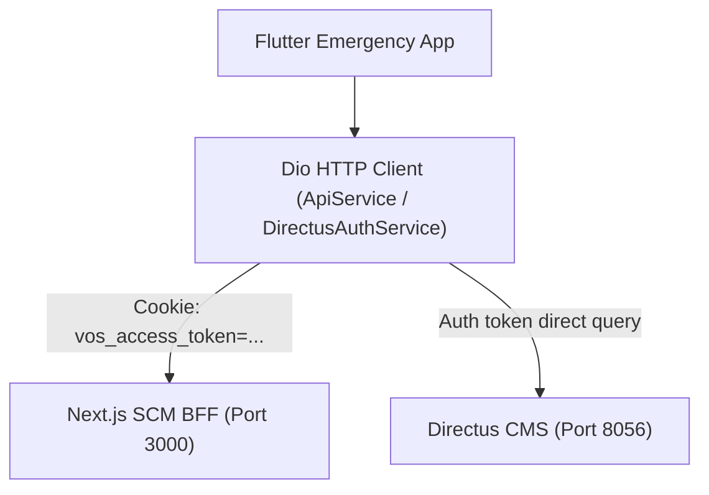

# AGENTS.md
> Consolidated behavioral guidelines, mobile development practices, and memory protocols for agents working on the **Fleet Emergency Mobile Application** (`fleet-emergency-app`) codebase.

**Interaction modes:** When in a read-only / planning mode, research and propose only — no edits. When in an implementation mode, make changes and run verification commands.

---

## Antigravity Config

This mobile project uses **Google Antigravity** as its agentic IDE. Antigravity reads `AGENTS.md` at the project root natively (supported since v1.20.3), so this file is your single source of truth for both the agent and any mobile-focused tool setup.

### Workspace layout

```
fleet-emergency-app/
├── AGENTS.md                        ← this file; read by Antigravity, Claude Code, Cursor, etc.
├── pubspec.yaml                     ← dependency management & project config
└── lib/
    ├── main.dart                    ← application entry point (network auto-discovery, routing)
    ├── models/                      ← DTOs & data representations (driver profile, emergency reports)
    ├── screens/                     ← UI views (login, SOS console, active distress panel)
    └── services/                    ← network, storage, & auth APIs (Dio clients, directus auth)
```

---

## 1. Think Before Coding

**Don't assume. Don't hide confusion. Surface tradeoffs.**

Before implementing:
- State your assumptions explicitly. If uncertain, ask.
- If multiple interpretations exist, present them — don't pick silently.
- If a simpler approach exists, say so. Push back when warranted.
- If something is unclear, stop. Name what's confusing. Ask.

---

## 2. Simplicity First

**Minimum code that solves the problem. Nothing speculative.**

- No features beyond what was asked.
- No abstractions for single-use code.
- No "flexibility" or "configurability" that wasn't requested.
- No error handling for impossible scenarios.
- If you write 200 lines and it could be 50, rewrite it.

Ask yourself: *"Would a senior engineer say this is overcomplicated?"* If yes, simplify.

---

## 3. Surgical Changes

**Touch only what you must. Clean up only your own mess.**

When editing existing Dart code:
- Don't "improve" adjacent widgets, comments, or formatting.
- Don't refactor code that isn't broken.
- Match existing style (Dart formatting, indentation, naming), even if you'd do it differently.
- If you notice unrelated dead code, mention it — don't delete it.

When your changes create orphans:
- Remove imports/variables/functions that **your** changes made unused.
- Don't remove pre-existing dead code unless asked.

The test: every changed line should trace directly to the user's request.

---

## 4. Goal-Driven Execution

**Define success criteria. Loop until verified.**

Transform tasks into verifiable goals:
- "Add validation" → "Verify validation handles null inputs, then make it pass"
- "Fix UI styling" → "Test responsiveness across screen sizes, then verify"

State a brief plan:
```
1. [Step] → verify: [check]
2. [Step] → verify: [check]
```

---

## 5. Mobile App Workspace & Architecture

### Stack

| Layer | Stack | Details |
|---|---|---|
| Core Framework | **Flutter** (Dart) | Multi-platform framework targeted for Mobile (Android/iOS) |
| Http Client | **Dio** | Configured with base options, timeouts, and cookie interceptors |
| Local Storage | **shared_preferences** | Cache auth tokens (`vos_access_token`) and user settings |
| Geolocation | **geolocator** | Access device location (GPS/Network) |



---

### Folder Conventions

Mirror this layout for every feature:
- `lib/models/` — Data models with strict JSON parsing (`fromJson`). Kept in sync with backend SCM representations.
- `lib/screens/` — UI screens. Keep widgets focused, use material widgets, and follow clean, dark-mode/light-mode UI rules.
- `lib/services/` — Core singleton services wrapping API requests (`ApiService`, `DirectusAuthService`).

---

### Core Mobile Development Rules

1. **Robust Location (GPS) Fetching**
   - Location lookups can easily freeze the app if network or GPS is flaky.
   - Always attempt `Geolocator.getLastKnownPosition()` first for instant feedback.
   - Limit `Geolocator.getCurrentPosition()` searches with a strict timeout (e.g., 4 seconds) and a medium accuracy setting (`LocationAccuracy.medium`) to prevent UI locks.
   - Track fetching state (`_gpsFetchDone`) to gracefully display 'Unavailable' or fallbacks on failure, rather than staying stuck on 'Locating...'.

2. **Network Resilience & Timeouts**
   - Mobile devices operate on flaky cellular or Tailscale connections. Keep connection and receive timeouts tight (e.g., 5 seconds for direct authentications, 30 seconds max for reports) to fail fast and trigger retries rather than hanging.
   - Use BFF auto-discovery (`autoDiscoverBaseUrl()`) to test multiple connection gateways (host machine IP, emulator loopback, localhost) in parallel.

3. **Session Persistent Cookies**
   - The Next.js BFF relies on cookie-based authentication (`vos_access_token`).
   - Use a custom interceptor wrapper in the Dio client to load/persist the `vos_access_token` inside `SharedPreferences` on login and inject it before every outbound HTTP request.

4. **Accidental Trigger Prevention**
   - Urgent state updates (like triggering an SOS beacon or resolving a crisis) must not happen by accident.
   - Never initiate distress calls directly on button tap without showing an explicit, clean confirmation modal (`showDialog`) first.

---

### Verification Commands

```bash
# Analyze code for static compilation and lint errors
flutter analyze

# Format files in place
flutter format lib/

# Run the app locally (make sure a device/emulator is connected)
flutter run
```

---

## 6. Shared SCM Memory Protocol

Since this mobile app works directly alongside the parent Next.js SCM project, all work and documentation must be synced inside the Obsidian memory vault located at the SCM root level (`../scm-vault/`).

### Rules
1. **Journal updates**: After implementing any changes to screens, services, or models in this app, append a detailed log to `../scm-vault/supply-chain/Task Execution Journal.md`.
2. **KISS**: Keep mobile code clean. Ensure all custom controller instances (like `TextEditingController` or `AnimationController`) are properly garbage collected inside widget `dispose()` methods.
